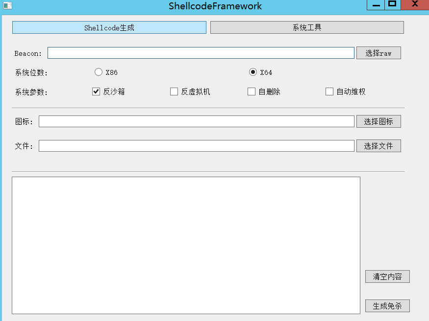

# shellcodeframework

一个测试软件，简单化shellcode-》exe的过程，可添加更多的扩展.


## 使用教程

启动界面:



选择raw生成即可，生成的文件在：template\outfile下面，运行即可。

暂时没有添加 自删除和自动维权模块，可以通过框架添加的。

暂时没有图标修改功能。


## 模板

在文件temple\ShellcodeTemplate有例子文件，如果编写，挺容易扩展的。


## 源码

源码在source\ShellcodeFramework文件中，如果需要修改可以自行下载。


## todo

把自定义变为shellcode形式，直接添加，而不是源码形式。


## 部分shellcode

```
\x48\x83\xec\x28\x48\x83\xe4\xf0\x48\x31\xc9\x65\x48\x8b\x41\x60\x48\x8b\x40\x18\x48\x8b\x70\x20\x48\xad\x48\x96\x48\xad\x48\x8b\x58\x20\x4d\x31\xc0\x44\x8b\x43\x3c\x4c\x89\xc2\x48\x01\xda\x48\x31\xc9\xb1\x88\x48\x01\xd1\x44\x8b\x01\x49\x01\xd8\x48\x31\xf6\x41\x8b\x70\x20\x48\x01\xde\x48\x31\xc9\x49\xb9\x47\x65\x74\x50\x72\x6f\x63\x41\x48\xff\xc1\x48\x31\xc0\x8b\x04\x8e\x48\x01\xd8\x4c\x39\x08\x75\xef\x48\x31\xf6\x41\x8b\x70\x24\x48\x01\xde\x66\x8b\x0c\x4e\x48\x31\xf6\x41\x8b\x70\x1c\x48\x01\xde\x48\x31\xd2\x8b\x14\x8e\x48\x01\xda\x48\x89\xd7\xb9\x61\x72\x79\x41\x51\x48\xb9\x4c\x6f\x61\x64\x4c\x69\x62\x72\x51\x48\x89\xe2\x48\x89\xd9\x48\x83\xec\x30\xff\xd7\x48\x83\xc4\x30\x48\x83\xc4\x10\x48\x89\xc6\x48\x31\xc0\x66\xb8\x6c\x6c\x50\x48\xb8\x75\x73\x65\x72\x33\x32\x2e\x64\x50\x48\x89\xe1\x48\x83\xec\x30\xff\xd6\x48\x83\xc4\x40\x50\x48\x31\xc0\xb8\x6f\x78\x41\x00\x50\x48\xb8\x4d\x65\x73\x73\x61\x67\x65\x42\x50\x48\x89\xe2\x48\x8b\x4c\x24\x10\x48\x83\xec\x28\xff\xd7\x48\x83\xc4\x38\x50\x48\x31\xc0\xb8\x65\x73\x73\x00\x50\x48\xb8\x45\x78\x69\x74\x50\x72\x6f\x63\x50\x48\x89\xe2\x48\x89\xd9\x48\x83\xec\x30\xff\xd7\x48\x83\xc4\x40\x50\x48\x31\xc0\xb8\x6d\x70\x6c\x65\x50\x48\xb8\x65\x42\x6f\x78\x20\x65\x78\x61\x50\x48\xb8\x61\x20\x4d\x65\x73\x73\x61\x67\x50\x48\xb8\x54\x68\x69\x73\x20\x69\x73\x20\x50\x54\x48\x31\xc0\x66\xb8\x65\x72\x50\x48\xb8\x65\x20\x43\x6f\x6d\x70\x69\x6c\x50\x48\xb8\x53\x68\x65\x6c\x6c\x63\x6f\x64\x50\x54\x4d\x31\xc9\x4c\x8b\x04\x24\x48\x8b\x54\x24\x20\x48\x31\xc9\x48\x83\xec\x20\xff\x54\x24\x70\x48\x83\xc4\x20\x48\x83\xc4\x48\x41\x54\x48\x31\xc9\x48\x83\xec\x20\xff\x54\x24\x28\x48\x83\xc4\x28
```

